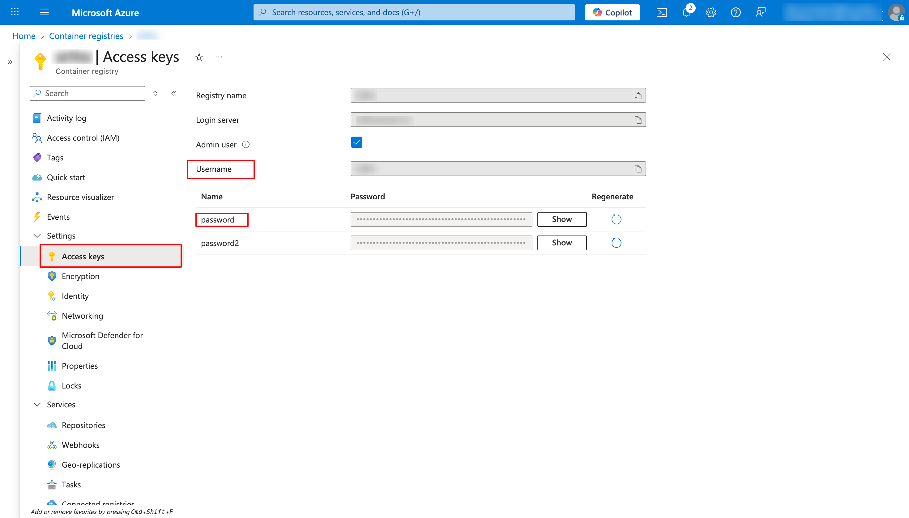

# Azure ACR Repositories Migration  
**From One Azure Account to Another**

This guide explains how to migrate Azure Container Registry (ACR) repositories from a source Azure account to a destination Azure account using Azure CLI.

---

## Prerequisites
- Azure CLI installed
- Access to both source and destination Azure subscriptions
- Source ACR Admin user enabled
- Docker installed on the system

---

## Step 1: Install Azure CLI
Install Azure CLI if it is not already installed.

https://learn.microsoft.com/cli/azure/install-azure-cli

Verify installation:
```bash
az version
```
---

## Step 2: Create ACR in Destination Azure Account
Login to the destination Azure account and create an Azure Container Registry.

---

## Step 3: Login to Destination Azure Account
```bash
az login
```
---

## Step 4: Get ACR Username & Password (FromSource Account)
### Steps:
##### 1. Login to source Azure account
##### 2. Go to Azure Container Registry
##### 3. Select your ACR
##### 4. Open Settings → Access keys
##### 5. Enable Admin user
##### 6. Copy Username and Password
##### 7. Update these values in the script:

```bash
SRC_USER
SRC_PASS
```

---

## Step 5: Run Migration Script
After updating all required variables (source ACR, destination ACR, credentials), run the migration script:

```bash
./acr-migration.sh
```
---

## Notes

The script pulls images from the source ACR and pushes them to the destination ACR

Ensure you are logged in to the destination ACR before running the script

Make sure sufficient permissions exist on both ACRs
