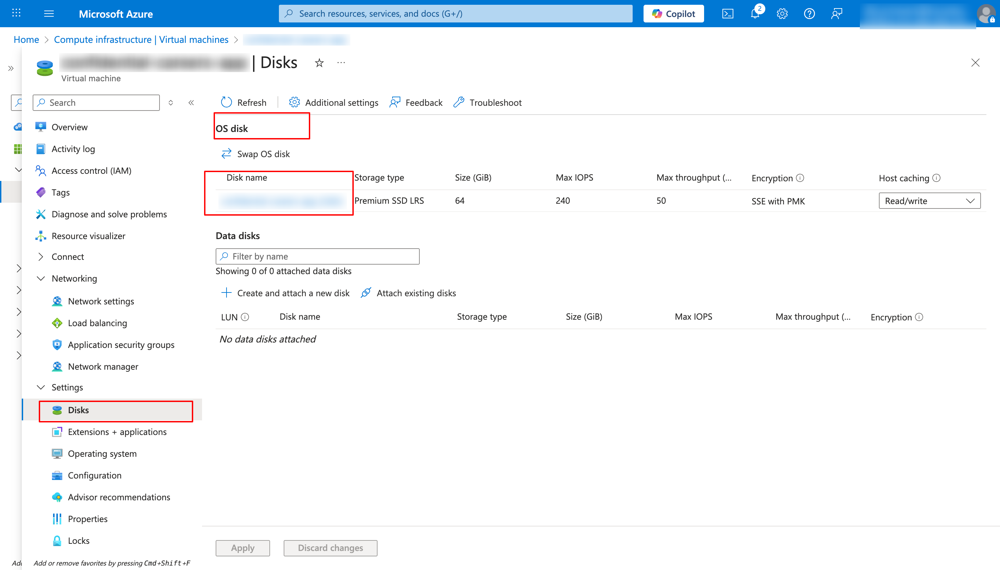
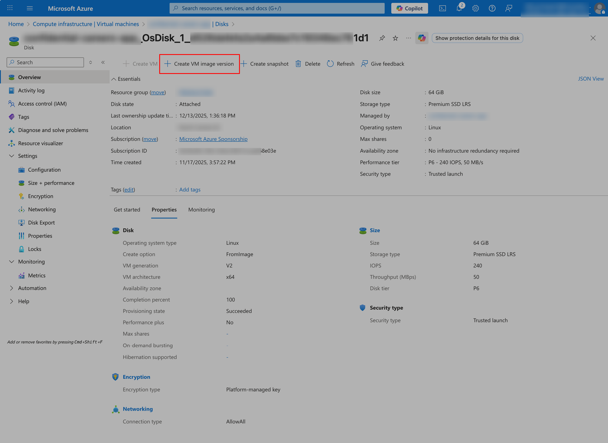
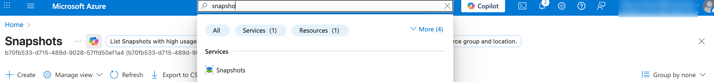
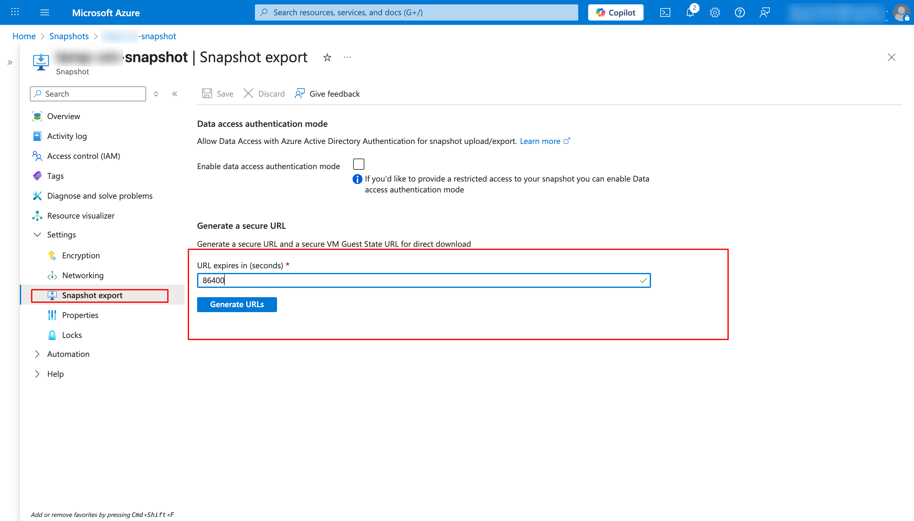
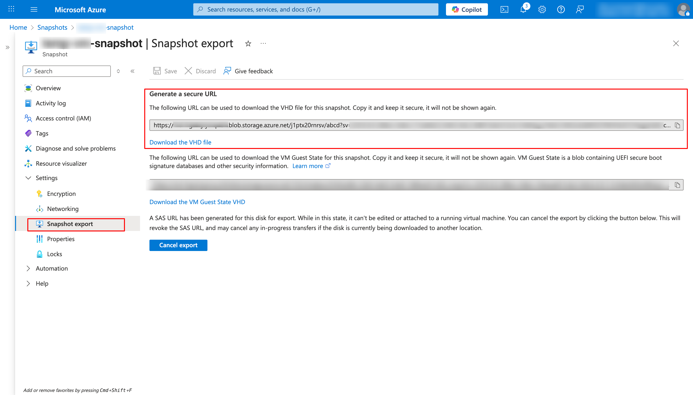
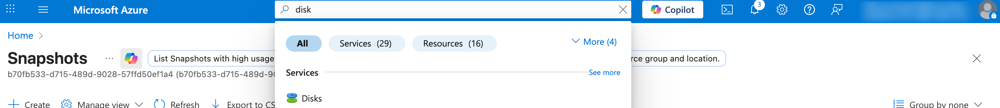
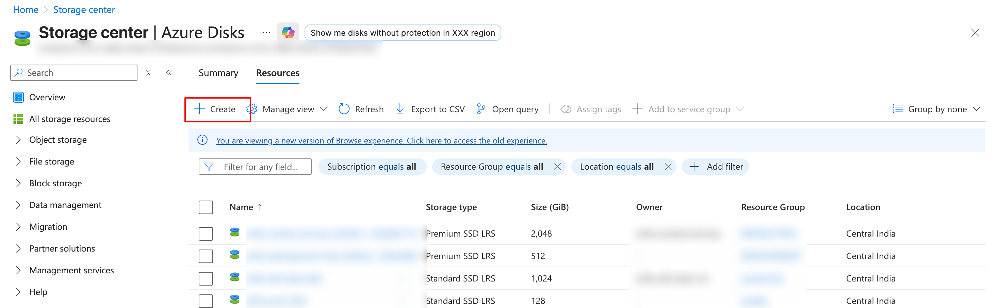
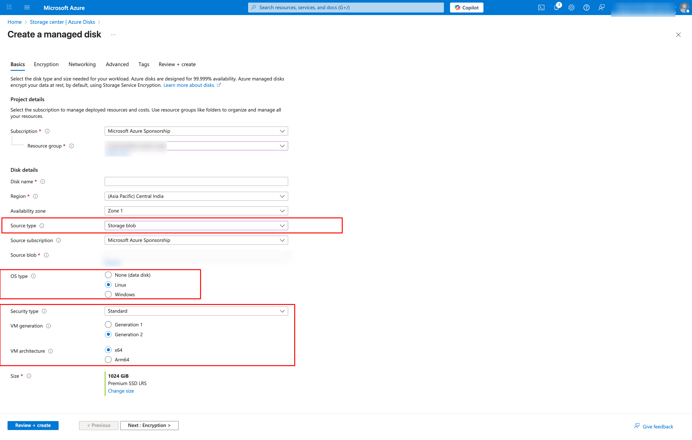

# Azure VM Migration Guide (Account-1 to Account-2)

This document explains how to migrate a Linux VM from one Azure account
(tenant/subscription) to another Azure account **without re-creating the VM manually**.

The process includes:
- OS disk snapshot
- VHD copy between accounts
- Disk creation
- VM creation from disk

---

## Prerequisites

- Access to **Source Azure Account**
- Access to **Destination Azure Account**
- Azure CLI installed
- SSH access to both old and new VMs
- Sufficient permissions to create:
  - Snapshots
  - Storage accounts
  - Disks
  - VMs

---

## High-Level Flow

1. Stop source VM
2. Create OS disk snapshot
3. Export snapshot to VHD
4. Copy VHD to destination storage account
5. Create managed disk from VHD
6. Create new VM from disk
7. Create new SSH keys (Optional)

---

## Step 1: Stop Source VM
1. Azure Portal → **Virtual Machines**
2. Select **Source VM**
3. Click **Stop**
4. Wait until VM state becomes **Stopped (deallocated)**

---

## Step 2: Create Snapshot of OS Disk
1. Open **Source VM**
2. Go to **Disks**
3. Click the **OS Disk**
4. Click **Create snapshot**
5. Enter:
   - Name: `<vm-name>-os-snapshot`
   - Resource Group: same as VM
6. Click **Create**




---

## Step 3: Generate SAS URL for Snapshot
1. Go to **Snapshots**
2. Open the snapshot you created
3. Click **Export**
4. Set:
   - Access level: **Read**
   - Duration: 24 hours (or more)
5. Click **Generate URL**
6. Copy the **SAS URL** (important)





---

## Step 4: Create Storage Account in Destination Account

1. Switch to **Destination Azure Account**
2. Azure Portal → **Storage accounts**
3. Click **Create**
4. Set:
   - Resource Group: destination RG
   - Name: unique name
   - Region: same as VM region
5. Click **Review + Create**
6. Inside storage:
➡ Containers → + Container
Name: vhds

---

## STEP 5: Copy Snapshot VHD to Destination Storage (UI)

1. Login into **Destination Azure Account** using azure cli
```bash
az login
```

2. Copy VHDS file from source snapshort to destination azure storage account

#### Export below variables
```bash
export DEST_SA="<destination-storage-account-name>"
export DEST_RG="<destination-storage-account-resource-group>"
export DEST_CONTAINER="<destination-storage-account-container-name>-<in-this-case-vhds>"
export DEST_BLOB="<give-file-name with extension .vhd> --> ex.tempvm-osdisk.vhd"
export SAS_URL="<PASTE_YOUR_SAS_URL_HERE_Created in setp 3>"
```

#### Start Migrating Disk snapshot
```bash
az storage blob copy start \
  --source-uri "$SAS_URL" \
  --account-name $DEST_SA \
  --account-key "$STORAGE_KEY" \
  --destination-container "$DEST_CONTAINER" \
  --destination-blob "$DEST_BLOB"
```

#### Check Status of disk snapshot (VHDS) migration
```bash
az storage blob show \
  --account-name $DEST_SA \
  --container-name $DEST_CONTAINER \
  --name $DEST_BLOB \
  --query "properties.copy.status"
```

It will show:

⏳ pending → while copying \
✔ success → once fully copied

⏱ Copy time expected:

30GB ~ 10–20 min \
(Your snapshot shows 30GB — so fast!)

#### Check status in % of disk snashpot migration run below script

```bash
./azure-resource-migration/VM/disk-snapshot-migration-progress.sh
```

---

## STEP 6: Create Managed Disk from VHD
1. Destination Azure Portal → **Disks**
2. Click **Create**
3. Set:
- Resource Group: destination RG
- Disk name: `migrated-os-disk`
- Source type: **Storage blob**
- Select Blog containr file in which .vhd file is migrated
- OS type: **Linux**
4. Click **Review + Create**





---

## STEP 7: Create VM from Existing Disk

1. Destination Azure Portal → **Disk**
2. Click **Create VM**


✅ SSH key will be same as in old vm, If you want we can rotate
(original SSH configuration is preserved)

---

## STEP 8: Verify VM Access

1. Open the new VM
2. Copy Public IP
3. SSH into VM:
```bash
ssh user@<public-ip>