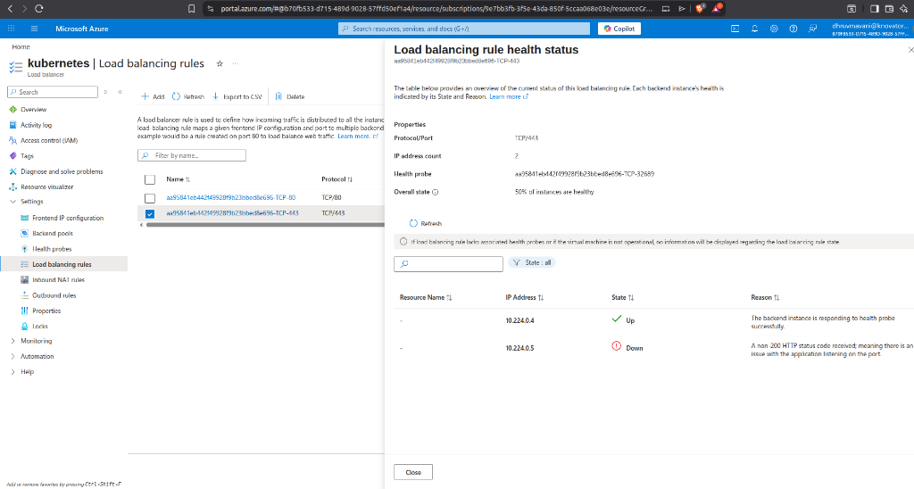

# NGINX Gateway Fabric Setup for Azure AKS

Complete setup for NGINX Gateway Fabric with client IP preservation and auto-scaling.

## Problem Statement

When using NGINX Gateway Fabric with Azure Load Balancer on AKS, we faced a conflict between:

| externalTrafficPolicy | Client IP Preserved | All Health Probes Pass |
|----------------------|---------------------|------------------------|
| **Local** | ✅ Yes | ❌ Only nodes with NGINX pods |
| **Cluster** | ❌ No (shows internal IP) | ✅ All nodes |



With `externalTrafficPolicy: Local`:
- ✅ Client IP visible in `X-Forwarded-For` header
- ❌ Azure LB health probes fail on nodes without NGINX pods

With `externalTrafficPolicy: Cluster`:
- ✅ All health probes pass
- ❌ Client IP shows internal pod IP instead of real client

## Solution

We implemented a multi-layer solution:

1. **Anti-Affinity Rules** - Spread NGINX pods across all nodes
2. **Auto-Scaling CronJob** - Automatically scale replicas to match node count
3. **PodDisruptionBudget** - Ensure at least 1 pod is always available

```
┌─────────────────────────────────────────────────────────────┐
│                    Azure Load Balancer                       │
│                  (All health probes pass ✅)                 │
└─────────────┬─────────────────────┬─────────────────────────┘
              │                     │
              ▼                     ▼
┌─────────────────────┐   ┌─────────────────────┐
│       Node 1        │   │       Node 2        │
│  ┌───────────────┐  │   │  ┌───────────────┐  │
│  │  NGINX Pod 1  │  │   │  │  NGINX Pod 2  │  │
│  │  (Gateway)    │  │   │  │  (Gateway)    │  │
│  └───────────────┘  │   │  └───────────────┘  │
│  Client IP: ✅      │   │  Client IP: ✅      │
└─────────────────────┘   └─────────────────────┘
              │                     │
              ▼                     ▼
        ┌─────────────────────────────────┐
        │     Backend Services (Apps)      │
        └─────────────────────────────────┘
```

## Files in this Setup

| File | Description |
|------|-------------|
| [nginx-gateway-values.yaml](./nginx-gateway-values.yaml) | Helm values with anti-affinity and externalTrafficPolicy |
| [ngf-autoscaler-rbac.yaml](./ngf-autoscaler-rbac.yaml) | RBAC for the auto-scaler CronJob |
| [ngf-autoscaler-cronjob.yaml](./ngf-autoscaler-cronjob.yaml) | CronJob to scale replicas to match nodes |
| [ngf-pdb.yaml](./ngf-pdb.yaml) | PodDisruptionBudget for high availability |

## Installation

### Step 1: Install Gateway API CRDs
```bash
kubectl apply -f https://github.com/kubernetes-sigs/gateway-api/releases/download/v1.2.1/standard-install.yaml
```

### Step 2: Install NGINX Gateway Fabric
```bash
helm install ngf oci://ghcr.io/nginxinc/charts/nginx-gateway-fabric \
  --namespace nginx-gateway \
  --create-namespace \
  --version 1.5.0 \
  -f nginx-gateway-values.yaml \
  --wait
```

### Step 3: Apply Auto-Scaler and PDB
```bash
kubectl apply -f ngf-autoscaler-rbac.yaml
kubectl apply -f ngf-autoscaler-cronjob.yaml
kubectl apply -f ngf-pdb.yaml
```

### Step 4: Verify Setup
```bash
# Check pods are spread across nodes
kubectl get pods -n nginx-gateway -o wide

# Check PDB status
kubectl get pdb -n nginx-gateway

# Check CronJob
kubectl get cronjob -n nginx-gateway
```

## How Auto-Scaling Works

The CronJob runs every minute and:
1. Counts the number of Ready nodes
2. Ensures minimum 1 replica always runs
3. Scales NGINX Gateway Fabric deployment to match node count

```bash
# Manually trigger the auto-scaler
kubectl create job --from=cronjob/ngf-autoscaler -n nginx-gateway ngf-autoscaler-manual
```

## Creating Gateway and Routes

After installation, create your Gateway and HTTPRoute resources:

```yaml
# Example Gateway
apiVersion: gateway.networking.k8s.io/v1
kind: Gateway
metadata:
  name: nginx-gateway
  namespace: nginx-gateway
spec:
  gatewayClassName: nginx
  listeners:
    - name: http
      protocol: HTTP
      port: 80
      allowedRoutes:
        namespaces:
          from: All
```

```yaml
# Example HTTPRoute
apiVersion: gateway.networking.k8s.io/v1
kind: HTTPRoute
metadata:
  name: my-route
  namespace: default
spec:
  parentRefs:
    - name: nginx-gateway
      namespace: nginx-gateway
  hostnames:
    - example.com
  rules:
    - backendRefs:
        - name: my-service
          port: 80
```
