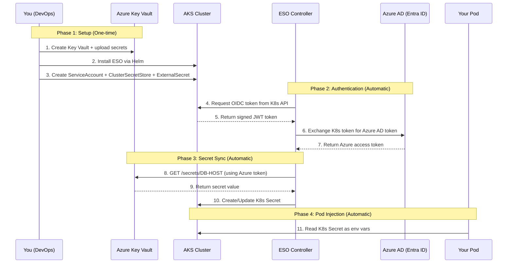
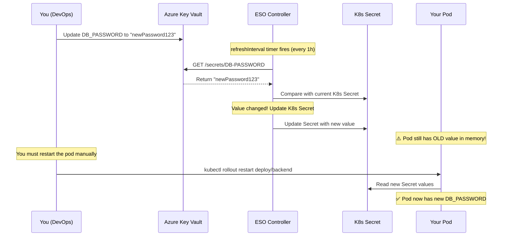

# External Secrets Operator (ESO) — How It Actually Works

A deep-dive guide explaining the full flow of External Secrets Operator with Azure Key Vault, including authentication, token exchange, secret syncing, and pod injection.

---

## Table of Contents

1. [The Big Picture](#1-the-big-picture)
2. [The Complete Flow (Step by Step)](#2-the-complete-flow)
3. [How Authentication Works (Workload Identity)](#3-how-authentication-works)
4. [How Secret Syncing Works](#4-how-secret-syncing-works)
5. [How Pods Get the Secrets](#5-how-pods-get-the-secrets)
6. [What Happens When a Secret Changes](#6-what-happens-when-a-secret-changes)
7. [Security Model](#7-security-model)
8. [Common Failure Points](#8-common-failure-points)

---

## 1. The Big Picture

### The Problem

Your application needs secrets (DB passwords, API keys, etc.). Traditionally, you'd put them in:
- A `.env` file → **insecure** (checked into Git)
- A Kubernetes ConfigMap → **insecure** (visible as plain text)
- A Kubernetes Secret with `kubectl create secret` → **manual** and hard to rotate

### The Solution

**External Secrets Operator (ESO)** bridges Azure Key Vault and Kubernetes:

```
┌─────────────────────────────────────────────────────────────────┐
│                        Azure Cloud                              │
│  ┌─────────────────┐                                            │
│  │  Azure Key Vault │ ← You store secrets here (portal/script)  │
│  │  (backend-kv)    │                                            │
│  └────────┬────────┘                                            │
│           │ HTTPS (TLS 1.2)                                     │
│           │                                                     │
│  ┌────────▼────────┐                                            │
│  │  Azure AD / OIDC │ ← Validates identity tokens               │
│  │  (Entra ID)      │                                            │
│  └────────┬────────┘                                            │
└───────────┼─────────────────────────────────────────────────────┘
            │ Federated Token Exchange
┌───────────┼─────────────────────────────────────────────────────┐
│           │        AKS Cluster                                  │
│  ┌────────▼────────┐     ┌──────────────────┐                   │
│  │  ESO Controller  │────▶│  K8s Secret       │                   │
│  │  (watches CRDs)  │     │  (auto-created)   │                   │
│  └─────────────────┘     └────────┬─────────┘                   │
│                                   │                             │
│                          ┌────────▼─────────┐                   │
│                          │  Your Pod          │                   │
│                          │  (reads env vars)  │                   │
│                          └──────────────────┘                   │
└─────────────────────────────────────────────────────────────────┘
```

**In simple terms:** ESO automatically copies secrets from Azure Key Vault into Kubernetes Secrets, so your pods can use them as environment variables — without ever storing credentials in your code.

---

## 2. The Complete Flow

Here is the entire flow from start to finish, in the order things happen:



---

## 3. How Authentication Works

This is the most complex part. ESO uses **Workload Identity** — a passwordless authentication method. Here's how it works in detail:

### 3.1 The Trust Chain

```
┌───────────────────────────────────────────────────────────────────┐
│                    THE TRUST CHAIN                                │
│                                                                   │
│  ServiceAccount ──▶ OIDC Token ──▶ Federated Credential ──▶     │
│  (K8s)               (signed JWT)    (Azure Portal)              │
│                                            │                     │
│                                            ▼                     │
│                                    Managed Identity ──▶          │
│                                    (Azure)                       │
│                                            │                     │
│                                            ▼                     │
│                                    RBAC Role ──▶ Key Vault       │
│                                    (Secrets User)   (Read)       │
└───────────────────────────────────────────────────────────────────┘
```

### 3.2 Step-by-Step Token Exchange

Here's exactly what happens when ESO needs to authenticate with Azure Key Vault:

**Step 1: ESO asks Kubernetes for a token**
```
ESO Controller → K8s API Server:
  "Give me a token for ServiceAccount 'backend-eso-sa' in namespace 'artha'"
```

The K8s API Server generates a **JWT (JSON Web Token)** that looks like this:
```json
{
  "iss": "https://centralindia.oic.prod-aks.azure.com/b70fb533.../",
  "sub": "system:serviceaccount:artha:backend-eso-sa",
  "aud": "api://AzureADTokenExchange",
  "exp": 1711200000
}
```

Key fields:
- `iss` (Issuer) = Your AKS cluster's OIDC URL (enabled in Step 3 of the guide)
- `sub` (Subject) = The ServiceAccount identity
- `aud` (Audience) = Must match what the Federated Credential expects

**Step 2: ESO exchanges the K8s token for an Azure AD token**
```
ESO Controller → Azure AD (Entra ID):
  "Here's my K8s JWT. Please give me an Azure access token for
   Managed Identity 'backend-eso-identity'"
```

Azure AD checks:
1. ✅ Is the `iss` (OIDC URL) trusted? → Yes, it matches the Federated Credential's issuer
2. ✅ Is the `sub` (ServiceAccount) valid? → Yes, it matches `system:serviceaccount:artha:backend-eso-sa`
3. ✅ Is the `aud` correct? → Yes, it's `api://AzureADTokenExchange`
4. ✅ Is the token not expired? → Yes

If all checks pass, Azure AD returns an **Azure access token**.

**Step 3: ESO uses the Azure token to read Key Vault**
```
ESO Controller → Azure Key Vault:
  "GET https://backend-kv.vault.azure.net/secrets/DB-HOST
   Authorization: Bearer <azure-access-token>"
```

Key Vault checks:
1. ✅ Is this token valid? → Yes
2. ✅ Does the Managed Identity have `Key Vault Secrets User` role? → Yes
3. ✅ Return the secret value

### 3.3 Why This is Secure

```
┌──────────────────────────────────────────────────────────┐
│              No passwords stored anywhere!                │
│                                                          │
│  ❌ No client secrets in K8s                             │
│  ❌ No API keys in environment variables                 │
│  ❌ No credentials in Helm charts                        │
│                                                          │
│  ✅ Token is short-lived (auto-expires)                  │
│  ✅ Identity is tied to a specific ServiceAccount         │
│  ✅ RBAC limits what the identity can do                 │
│  ✅ Federated Credential locks to a specific namespace   │
└──────────────────────────────────────────────────────────┘
```

---

## 4. How Secret Syncing Works

### 4.1 The Reconciliation Loop

ESO runs a **continuous reconciliation loop** inside the cluster. Think of it as a background worker that periodically checks for changes.

```
┌─────────────────────────────────────────────────────────┐
│                 ESO Reconciliation Loop                  │
│                                                         │
│   ┌───────────────┐                                     │
│   │ ExternalSecret │──── refreshInterval: 1h ───┐       │
│   │ (your CRD)     │                             │       │
│   └───────────────┘                             │       │
│                                                  ▼       │
│                                          ┌──────────┐   │
│                                          │ Timer     │   │
│                                          │ triggers  │   │
│                                          └─────┬────┘   │
│                                                │        │
│     ┌──────────────────────────────────────────┘        │
│     │                                                   │
│     ▼                                                   │
│   ┌──────────────────────────────────────────┐          │
│   │ For each secret in ExternalSecret.data:  │          │
│   │   1. Authenticate to Azure Key Vault     │          │
│   │   2. GET secret value from Key Vault     │          │
│   │   3. Compare with current K8s Secret     │          │
│   │   4. If changed → Update K8s Secret      │          │
│   │   5. If same → Skip (no-op)              │          │
│   └──────────────────────────────────────────┘          │
│                                                         │
│   Then sleep for refreshInterval (1h) and repeat...     │
└─────────────────────────────────────────────────────────┘
```

### 4.2 What Gets Created

When ESO processes an `ExternalSecret`, it creates a standard Kubernetes `Secret`:

```
ExternalSecret (your CRD)          K8s Secret (auto-created by ESO)
┌────────────────────────┐         ┌─────────────────────────────┐
│ name: backend-secrets  │         │ name: backend-env-secrets   │
│ data:                  │ ──────▶ │ data:                       │
│   - secretKey: DB_HOST │         │   DB_HOST: base64("10.0.0.4")│
│     remoteRef:         │         │   DB_PORT: base64("57017")   │
│       key: DB-HOST     │         │   DB_PASSWORD: base64("xxx") │
│   - secretKey: DB_PORT │         └─────────────────────────────┘
│     ...                │
└────────────────────────┘

     YOUR DEFINITION              WHAT ESO ACTUALLY CREATES
```

### 4.3 The Naming Convention

```
Your .env file          Azure Key Vault         ExternalSecret YAML
─────────────          ────────────────         ──────────────────
DB_HOST=10.0.0.4  ──▶  DB-HOST (hyphens)  ──▶  secretKey: DB_HOST
                        ▲                        remoteRef.key: DB-HOST
                        │
                  Underscores (_) become
                  Hyphens (-) because Key
                  Vault doesn't allow
                  underscores in names
```

---

## 5. How Pods Get the Secrets

Once ESO creates the K8s Secret, your pods read it using `envFrom`:

```yaml
# In your Deployment YAML
spec:
  containers:
    - name: backend
      image: your-app:latest
      envFrom:
        - secretRef:
            name: backend-env-secrets    # ← The K8s Secret created by ESO
```

### What happens at pod startup:

```
┌──────────────────────────────────────────────────────┐
│                     Pod Startup                       │
│                                                      │
│  1. Kubelet sees: envFrom → secretRef: backend-env   │
│                                                      │
│  2. Kubelet reads K8s Secret "backend-env-secrets"   │
│                                                      │
│  3. For each key in the Secret:                      │
│     DB_HOST=10.0.0.4                                 │
│     DB_PORT=57017                                    │
│     DB_PASSWORD=KivkF9F5C6y                          │
│     JWT_SECRET=s0m3Cret&$                            │
│     ...all 166 env vars                              │
│                                                      │
│  4. Injects them as environment variables             │
│                                                      │
│  5. Your app reads process.env.DB_HOST = "10.0.0.4"  │
└──────────────────────────────────────────────────────┘
```

Your app code doesn't change at all. It still reads `process.env.DB_HOST` — it just doesn't know the value came from Azure Key Vault.

---

## 6. What Happens When a Secret Changes

### Scenario: You update `DB_PASSWORD` in Key Vault



### Important: Pods Do NOT Auto-Restart

When a secret changes in Key Vault:
1. ✅ ESO **automatically** updates the K8s Secret (after `refreshInterval`)
2. ❌ Pods do **NOT** automatically restart
3. 🔧 You must manually restart: `kubectl rollout restart deployment/backend`

**To make it automatic**, install **Stakater Reloader** (documented in the main guide).

---

## 7. Security Model

### Who Has Access to What

```
┌────────────────────────────────────────────────────────────────┐
│                      RBAC PERMISSIONS                          │
│                                                                │
│  YOU (DevOps Engineer)                                         │
│  ├── Role: Key Vault Secrets Officer                           │
│  ├── Can: Create, Read, Update, Delete secrets                 │
│  └── Used for: Running upload-to-keyvault.sh                   │
│                                                                │
│  MANAGED IDENTITY (backend-eso-identity)                       │
│  ├── Role: Key Vault Secrets User                              │
│  ├── Can: Read secrets ONLY                                    │
│  └── Used by: ESO Controller (via Workload Identity)           │
│                                                                │
│  ESO CONTROLLER                                                │
│  ├── Authenticates via: Workload Identity (no passwords)       │
│  ├── Can: Read Key Vault secrets, Create/Update K8s Secrets    │
│  └── Cannot: Modify Key Vault secrets                          │
│                                                                │
│  YOUR POD                                                      │
│  ├── Reads from: K8s Secret (injected as env vars)             │
│  ├── Cannot: Access Key Vault directly                         │
│  └── Cannot: See other apps' secrets                           │
└────────────────────────────────────────────────────────────────┘
```

### The Isolation Model (3 Key Vaults)

```
┌─────────────┐    ┌─────────────────┐    ┌──────────────────┐
│  admin-kv   │    │  frontend-kv    │    │   backend-kv     │
│  (Key Vault)│    │  (Key Vault)    │    │   (Key Vault)    │
└──────┬──────┘    └────────┬────────┘    └────────┬─────────┘
       │                    │                      │
       ▼                    ▼                      ▼
┌──────────────┐  ┌──────────────────┐  ┌──────────────────┐
│admin-eso-    │  │frontend-eso-     │  │backend-eso-      │
│identity      │  │identity          │  │identity          │
│(Managed ID)  │  │(Managed ID)      │  │(Managed ID)      │
└──────┬───────┘  └────────┬─────────┘  └────────┬─────────┘
       │                    │                      │
       ▼                    ▼                      ▼
┌──────────────┐  ┌──────────────────┐  ┌──────────────────┐
│admin-eso-sa  │  │frontend-eso-sa   │  │backend-eso-sa    │
│(ServiceAcct) │  │(ServiceAcct)     │  │(ServiceAcct)     │
└──────────────┘  └──────────────────┘  └──────────────────┘

Each app can ONLY access its own Key Vault. Even if the
backend pod is compromised, it cannot read admin secrets.
```

---

## 8. Common Failure Points

### Quick Troubleshooting Guide

| Symptom | Likely Cause | Fix |
|---|---|---|
| `InvalidProviderConfig` | Missing `tenantId` in ClusterSecretStore | Add `tenantId` field to the YAML |
| `403 Forbidden` (script) | You don't have `Key Vault Secrets Officer` role | Assign the role in Portal → IAM |
| `403 Forbidden` (ESO) | Managed Identity doesn't have `Key Vault Secrets User` | Assign the role in Portal → IAM |
| `SecretNotFound` | Key name mismatch (underscore vs hyphen) | Check: Key Vault uses hyphens (`DB-HOST`), ExternalSecret uses `remoteRef.key: DB-HOST` |
| `InvalidProviderConfig: unable to create client` | Federated Credential misconfigured | Verify: issuer URL, subject, audience all match |
| Secret value not updating in pod | Pod needs restart after K8s Secret update | Run `kubectl rollout restart deploy/<name>` |
| `resource mapping not found` | Wrong `apiVersion` in YAML | Use `apiVersion: external-secrets.io/v1` (not `v1beta1`) |

### How to Debug

```bash
# 1. Check ClusterSecretStore status
kubectl get clustersecretstore
# Should show: READY = True

# 2. Check ExternalSecret status
kubectl get externalsecret -n artha
# Should show: STATUS = SecretSynced

# 3. Check ESO logs for detailed errors
kubectl logs -n external-secrets -l app.kubernetes.io/name=external-secrets --tail=50

# 4. Describe a failing ExternalSecret for events
kubectl describe externalsecret backend-secrets -n artha

# 5. Verify a specific secret was synced
kubectl get secret backend-env-secrets -n artha -o jsonpath='{.data.DB_HOST}' | base64 -d
```

---

> **Summary:** External Secrets Operator acts as an automatic bridge between Azure Key Vault and Kubernetes. It uses Workload Identity (passwordless tokens) to authenticate, reads your secrets from Key Vault on a schedule, and creates standard Kubernetes Secrets that your pods consume as environment variables. No credentials are ever stored in your cluster.
