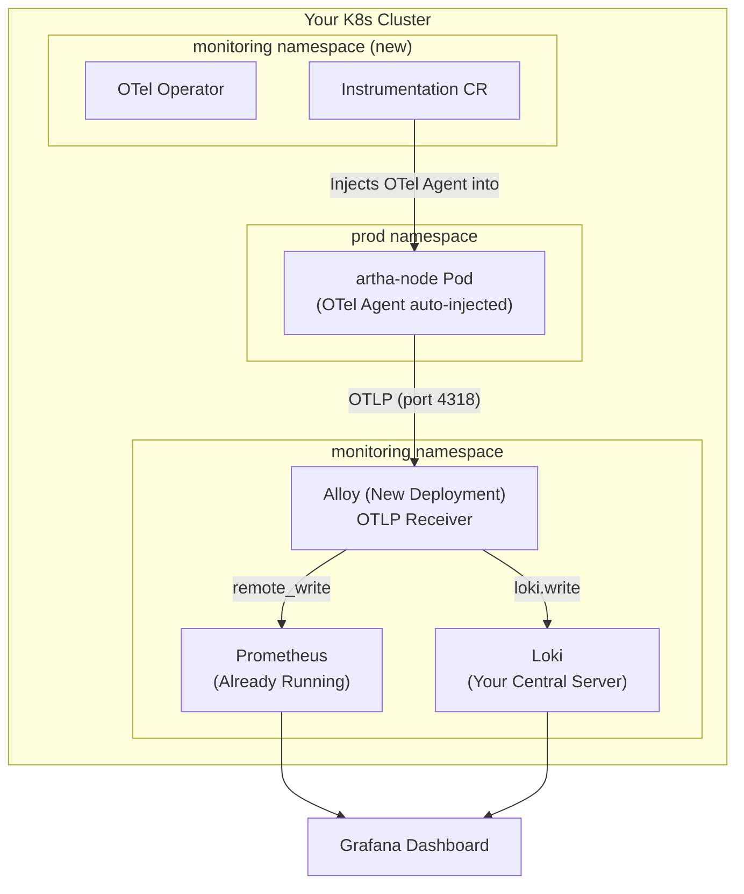

# Complete API Monitoring Setup: OpenTelemetry + Grafana Alloy (artha-node)

A production-ready guide tailored to your existing `monitoring` namespace infrastructure.

---

## Your Existing Infrastructure

| Component | Resource | Service Endpoint |
|---|---|---|
| Prometheus | `prometheus-k8s-prometheus-kube-promet-prometheus-0` | `k8s-prometheus-kube-promet-prometheus.monitoring.svc.cluster.local:9090` |
| Alloy (Logs) | `alloy-logs` DaemonSet | `alloy-logs.monitoring.svc.cluster.local:12345` |
| Kube-State-Metrics | `k8s-prometheus-kube-state-metrics` | Running |
| Node Exporter | `k8s-prometheus-prometheus-node-exporter` DaemonSet | Running |

---

## Architecture: How it Works



### How ONE annotation monitors ALL your APIs:

1. **You annotate** your `artha-node` Deployment with `instrumentation.opentelemetry.io/inject-nodejs: "true"`.
2. **The OTel Operator** sees this annotation and injects an `initContainer` into every pod of that Deployment.
3. **The initContainer** copies the OTel Node.js SDK into the pod's filesystem.
4. **The pod starts** with `--require` flag pointing to the OTel SDK. This wraps `express`, `http`, `mongoose`, `redis`, `kafkajs`, etc. automatically.
5. **Every HTTP request** that hits any route in your app (e.g., `/api/v1/users`, `/api/v1/jobs/:id`, `/admin/login`) is automatically captured with:
   - `http_route` → The Express route template (e.g., `/api/v1/users/:id`)
   - `http_method` → GET, POST, PUT, DELETE
   - `http_status_code` → 200, 201, 400, 404, 500
   - `http_server_duration` → Latency in milliseconds
6. **The OTel Agent** inside the pod sends all this data via OTLP to Alloy.
7. **Alloy** converts it to Prometheus metrics and pushes to your existing Prometheus.
8. **Grafana** reads from Prometheus and displays the dashboard.

> **Key takeaway:** You don't touch any of your 100+ API routes. The OTel SDK discovers them all automatically.

---

## Understanding OTel Operator Components

To manage this "Zero-Code" setup, the Operator uses 4 main components:

- **Instrumentation:** The "Auto-Injcetor." It automatically adds the OTel SDK to your apps (like `artha-node`) so you don't have to change your code.
- **OpenTelemetry Collector:** The "Data Hub." It receives metrics/logs from your apps, cleans them up, and sends them to your monitoring tools.
- **Target Allocator:** The "Smart Scraper." It helps the Collector find and scrape metrics from many different pods efficiently.
- **OpAMP Bridge:** The "Remote Manager." It allows you to manage and update your OTel Collectors from a central place.

---

## Step 1: Install Cert-Manager (if not already installed)

The OTel Operator requires cert-manager for webhook certificates.

```bash
# Check if cert-manager is already installed
kubectl get pods -n cert-manager

# If NOT installed:
helm repo add jetstack https://charts.jetstack.io
helm repo update
kubectl apply -f https://github.com/cert-manager/cert-manager/releases/download/v1.17.2/cert-manager.yaml
```

---

## Step 2: Install OpenTelemetry Operator

```bash
helm repo add open-telemetry https://open-telemetry.github.io/opentelemetry-helm-charts
helm repo update

helm install opentelemetry-operator open-telemetry/opentelemetry-operator \
  --namespace monitoring \
  --set "manager.collectorImage.repository=ghcr.io/open-telemetry/opentelemetry-collector-releases/opentelemetry-collector-contrib" \
  --set admissionWebhooks.certManager.enabled=true
```

### Verify:
```bash
kubectl get pods -n monitoring | grep opentelemetry
# Expected: opentelemetry-operator-xxxx  1/1  Running
```

---

## Step 3: Create the Instrumentation Resource

This tells the Operator HOW to instrument Node.js apps.

Create file `instrumentation.yaml`:
```yaml
apiVersion: opentelemetry.io/v1alpha1
kind: Instrumentation
metadata:
  name: artha-otel-instrumentation
  namespace: monitoring
spec:
  exporter:
    endpoint: http://alloy-otel.monitoring.svc.cluster.local:4318 # Will create this in Step 4
  propagators:
    - tracecontext
    - baggage
  sampler:
    type: parentbased_traceidratio
    argument: "0.25" # Sample 25% of traces to reduce overhead
  nodejs:
    image: ghcr.io/open-telemetry/opentelemetry-operator/autoinstrumentation-nodejs:latest
    env:
      - name: OTEL_NODE_ENABLED_INSTRUMENTATIONS
        value: "express,http,net,dns,mongoose,redis,kafkajs"
```

```bash
kubectl apply -f instrumentation.yaml
```

### Line-by-Line Breakdown of `instrumentation.yaml`

| Line | Field | Explanation |
| :--- | :--- | :--- |
| **1-2** | `apiVersion/kind` | Tells Kubernetes this is an OTel Operator resource. |
| **3-5** | `metadata` | Sets the name (`artha-otel-instrumentation`) and namespace (`monitoring`). |
| **7-8** | `exporter.endpoint` | The address where the OTel Agent will send metrics (your Alloy receiver). |
| **9-11** | `propagators` | Ensures request IDs are passed between services (Trace Context). |
| **12-14** | `sampler` | Controls data volume. `0.25` means it only records 25% of requests to save CPU/Memory. |
| **15-16** | `nodejs.image` | The OTel SDK image that the operator will inject into your pods. |
| **17-19** | `nodejs.env` | Configures the SDK. `OTEL_NODE_ENABLED_INSTRUMENTATIONS` tells it exactly which libraries (Express, Mongoose, etc.) to monitor. |

---

### FAQ: `Instrumentation` Resources

**Q: Can I use 1 `Instrumentation` for all my Node.js deployments?**
**A:** Yes! You can point multiple Deployments (e.g., `artha-api`, `cron-service`, `email-service`) to the same `Instrumentation` resource.

**Q: Should `Instrumentation` be in the same namespace as my app?**
**A:** It can be anywhere. If it's in the **same** namespace, use `artha-otel-instrumentation`. If it's in a **different** namespace (like `monitoring`), you MUST use the full path: `monitoring/artha-otel-instrumentation`.

### Verify:
```bash
kubectl get instrumentation -n monitoring
# Expected: artha-otel-instrumentation
```

---

## Step 4: Deploy Alloy OTLP Receiver

Your existing `alloy-logs` DaemonSet handles logs. We need a **separate Alloy Deployment** specifically for receiving OTel metrics.

### Difference between `alloy-logs` and `alloy-otel`:

| Feature | `alloy-logs` (Existing) | `alloy-otel` (New) |
| :--- | :--- | :--- |
| **K8s Type** | **DaemonSet** (1 pod per node) | **Deployment** (Central pods) |
| **Primary Job** | Reads log files from the disk. | Receives OTLP data over the network. |
| **Data Type** | Plain Logs. | Metrics, Traces, and OTLP Logs. |
| **Why both?** | Grab system/app logs from the node. | Acts as the central hub for your APIs. |

Create file `alloy-otel-values.yaml`:
```yaml
fullnameOverride: "alloy-otel"

alloy:
  extraPorts:
    - name: otlp-http
      port: 4318
      targetPort: 4318
      protocol: TCP
    - name: otlp-grpc
      port: 4317
      targetPort: 4317
      protocol: TCP
  configMap:
    content: |
      // ===== OTLP Receiver =====
      otelcol.receiver.otlp "default" {
        http {
          endpoint = "0.0.0.0:4318"
        }
        grpc {
          endpoint = "0.0.0.0:4317"
        }

        output {
          metrics = [otelcol.processor.batch.default.input]
        }
      }

      // ===== Batch Processor (reduces network overhead) =====
      otelcol.processor.batch "default" {
        timeout = "5s"
        send_batch_size = 1000

        output {
          metrics = [otelcol.exporter.prometheus.to_prometheus.input]
        }
      }

      // ===== Export to your existing Prometheus =====
      otelcol.exporter.prometheus "to_prometheus" {
        forward_to = [prometheus.remote_write.existing_prometheus.receiver]
      }

      prometheus.remote_write "existing_prometheus" {
        endpoint {
          url = "http://k8s-prometheus-kube-promet-prometheus.monitoring.svc.cluster.local:9090/api/v1/write"
        }
      }
```

```bash
helm install alloy-otel grafana/alloy \
  --namespace monitoring \
  -f alloy-otel-values.yaml \
  --set crds.create=false
```

### Verify:
```bash
kubectl get pods -n monitoring | grep alloy-otel
# Expected: alloy-otel-xxxx  1/1  Running

kubectl get svc -n monitoring | grep alloy-otel
# Expected: alloy-otel  ClusterIP  x.x.x.x  4317/TCP,4318/TCP,12345/TCP
```

---

### Phase 3: Prometheus Configuration (CRITICAL)

For Prometheus to accept the data pushed by Alloy, you **must** enable the "Remote Write Receiver".

Update your `kube-prometheus-stack` values file `prometheus-values.yaml`:
```yaml
prometheus:
  prometheusSpec:
    enableRemoteWriteReceiver: true
```
Apply with: `helm upgrade k8s-prometheus prometheus-community/kube-prometheus-stack --namespace monitoring -f prometheus-values.yaml `

---

## Step 5: Annotate your Deployment

Add the OTel annotation to your app Deployment. 

> [!IMPORTANT]
> The annotation MUST be placed in **`spec.template.metadata.annotations`** (Pod-level), NOT the Top-level Deployment metadata.

### Example Update in `backend.yaml`:
```yaml
spec:
  template:
    metadata:
      annotations:
        # Link to your Instrumentation resource
        instrumentation.opentelemetry.io/inject-nodejs: "monitoring/artha-otel-instrumentation"
    spec:
      containers:
        - name: backend-container
          # ... rest of your existing container spec
```

### Understanding Metric Labels
By default, your Prometheus setup may overwrite OTel labels with its own. In our case, the service is identified by the **`job`** label (e.g., `artha/backend`).
```

### Verify:
```bash
# Check the pod has an init container
kubectl describe pod -l app=artha-node -n <YOUR_APP_NAMESPACE> | grep -A 5 "Init Containers"
# Expected: opentelemetry-auto-instrumentation-nodejs

# Check logs for OTel initialization
kubectl logs -l app=artha-node -n <YOUR_APP_NAMESPACE> | grep -i otel
```

---

## Step 6: Grafana Dashboard

### Metrics Available (after ~2 minutes)

| Metric Name | Description | Type |
|---|---|---|
| `http_server_duration_milliseconds_count` | Total number of requests | Counter |
| `http_server_duration_milliseconds_sum` | Total time spent serving requests | Counter |
| `http_server_duration_milliseconds_bucket` | Request duration distribution | Histogram |
| `http_server_active_requests` | Currently active requests | Gauge |

### Dashboard Panels

#### Panel 1: Total Requests per Endpoint (Time Series)
```promql
sum(rate(http_server_duration_milliseconds_count{job="artha/backend"}[$__rate_interval])) by (http_route, http_method)
```

#### Panel 2: Status Code Distribution (Pie Chart)
```promql
sum(increase(http_server_duration_milliseconds_count{job="artha/backend"}[$__range])) by (http_status_code)
```

#### Panel 3: Success Rate % (Stat Panel)
```promql
(
  sum(rate(http_server_duration_milliseconds_count{job="artha/backend", http_status_code=~"2.."}[$__rate_interval]))
  /
  sum(rate(http_server_duration_milliseconds_count{job="artha/backend"}[$__rate_interval]))
) * 100
```

#### Panel 4: Error Rate % (Stat Panel)
```promql
(
  sum(rate(http_server_duration_milliseconds_count{job="artha/backend", http_status_code=~"[45].."}[$__rate_interval]))
  /
  sum(rate(http_server_duration_milliseconds_count{job="artha/backend"}[$__rate_interval]))
) * 100
```

#### Panel 5: Latency p50 / p95 / p99 (Time Series)
```promql
# p50
histogram_quantile(0.50, sum(rate(http_server_duration_milliseconds_bucket{job="artha/backend"}[$__rate_interval])) by (le, http_route))

# p95
histogram_quantile(0.95, sum(rate(http_server_duration_milliseconds_bucket{job="artha/backend"}[$__rate_interval])) by (le, http_route))

# p99
histogram_quantile(0.99, sum(rate(http_server_duration_milliseconds_bucket{job="artha/backend"}[$__rate_interval])) by (le, http_route))
```

#### Panel 6: Active Requests (Gauge)
```promql
sum(http_server_active_requests{job="artha/backend"}) by (http_route)
```

#### Panel 7: Top 10 Slowest Endpoints (Bar Gauge)
```promql
topk(10, histogram_quantile(0.95, sum(rate(http_server_duration_milliseconds_bucket{job="artha/backend"}[$__rate_interval])) by (le, http_route)))
```

#### Panel 8: Request Rate by Status Code Group (Stacked Time Series)
```promql
# 2xx
sum(rate(http_server_duration_milliseconds_count{job="artha/backend", http_status_code=~"2.."}[$__rate_interval]))
# 3xx
sum(rate(http_server_duration_milliseconds_count{job="artha/backend", http_status_code=~"3.."}[$__rate_interval]))
# 4xx
sum(rate(http_server_duration_milliseconds_count{job="artha/backend", http_status_code=~"4.."}[$__rate_interval]))
# 5xx
sum(rate(http_server_duration_milliseconds_count{job="artha/backend", http_status_code=~"5.."}[$__rate_interval]))
```

---

## Step 7: Verification Checklist

| Step | Command | Expected |
|---|---|---|
| OTel Operator Running | `kubectl get pods -n monitoring \| grep opentelemetry` | `1/1 Running` |
| Instrumentation Created | `kubectl get instrumentation -n monitoring` | `artha-otel-instrumentation` |
| Alloy OTLP Running | `kubectl get pods -n monitoring \| grep alloy-otel` | `1/1 Running` |
| Init Container Injected | `kubectl describe pod <artha-pod>` | `opentelemetry-auto-instrumentation` initContainer |
| Metrics in Prometheus | Grafana Explore → `http_server_duration_milliseconds_count` | Data points appear |

---

## Troubleshooting

### No metrics appearing?
1. **Check init container logs:**
   ```bash
   kubectl logs <artha-pod> -c opentelemetry-auto-instrumentation-nodejs -n <ns>
   ```
2. **Check Alloy OTLP logs:**
   ```bash
   kubectl logs -l app.kubernetes.io/name=alloy-otel -n monitoring
   ```
3. **Check Prometheus remote_write target:**
   - Grafana → Prometheus → Status → Targets → Look for remote_write endpoint.

### High cardinality / too many metrics?
- Reduce the `OTEL_NODE_ENABLED_INSTRUMENTATIONS` list in the Instrumentation CR.
- Increase the `sampler.argument` value (e.g., `0.1` = 10% sampling).
